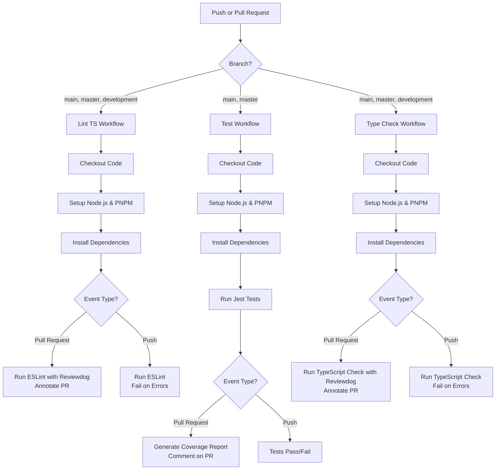

# Agile Atlas Frontend

## CI/CD Workflow

```mermaid
graph TD
    A[Push or Pull Request] --> B{Branch?}
    B -->|main, master, development| C[Lint TS Workflow]
    B -->|main, master| D[Test Workflow]
    B -->|main, master, development| E[Type Check Workflow]

    C --> F[Checkout Code]
    F --> G[Setup Node.js & PNPM]
    G --> H[Install Dependencies]
    H --> I{Event Type?}
    I -->|Pull Request| J[Run ESLint with Reviewdog<br/>Annotate PR]
    I -->|Push| K[Run ESLint<br/>Fail on Errors]

    D --> L[Checkout Code]
    L --> M[Setup Node.js & PNPM]
    M --> N[Install Dependencies]
    N --> O[Run Jest Tests]
    O --> P{Event Type?}
    P -->|Pull Request| Q[Generate Coverage Report<br/>Comment on PR]
    P -->|Push| R[Tests Pass/Fail]

    E --> S[Checkout Code]
    S --> T[Setup Node.js & PNPM]
    T --> U[Install Dependencies]
    U --> V{Event Type?}
    V -->|Pull Request| W[Run TypeScript Check with Reviewdog<br/>Annotate PR]
    V -->|Push| X[Run TypeScript Check<br/>Fail on Errors]
```
