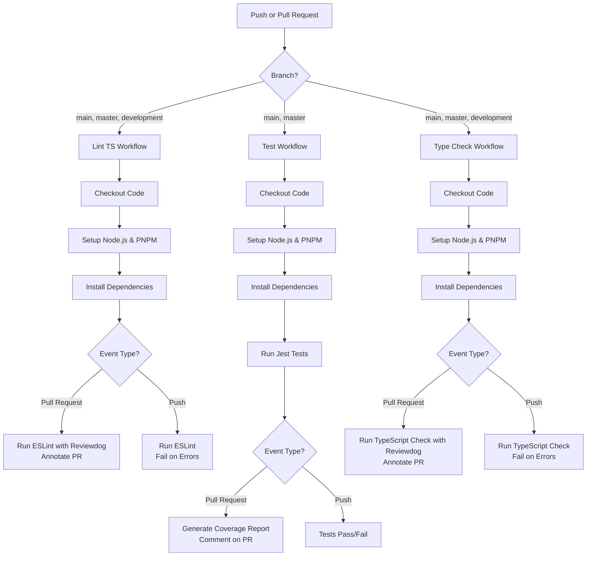

# Agile Atlas Frontend

## CI/CD Workflow



## Optimized Data Fetching with Suspense

```tsx
// routes/_auth/dashboard.tsx

export const Route = createFileRoute('/_auth/dashboard')({
  loader: async ({ context }) => {
    const statsPromise = context.queryClient.ensureQueryData(statsQueryOptions)
    context.queryClient.prefetchQuery(tasksQueryOptions)
    context.queryClient.prefetchQuery(activityQueryOptions)
    context.queryClient.prefetchQuery(recentUsersQueryOptions)
    await statsPromise
  },
  component: Dashboard,
})

function Dashboard() {
  return (
    <div className="p-6 space-y-6">
      <Suspense fallback={<StatsGridSkeleton />}>
        <StatsGrid />
      </Suspense>

      <div className="grid grid-cols-12 gap-6">
        <div className="col-span-8">
          <Suspense fallback={<TasksListSkeleton />}>
            <TasksList />
          </Suspense>
        </div>

        <div className="col-span-4">
          <Suspense fallback={<ActivitySkeleton />}>
            <RecentActivity />
          </Suspense>
        </div>
      </div>

      <Suspense fallback={<UsersTableSkeleton />}>
        <RecentUsers />
      </Suspense>
    </div>
  )
}
```

### Component Implementations

```tsx
function StatsGrid() {
  const { data: stats } = useSuspenseQuery(statsQueryOptions)
  return (
    <div className="grid grid-cols-4 gap-4">
      <StatCard title="Total" value={stats.total} />
      <StatCard title="Active" value={stats.active} />
      <StatCard title="Pending" value={stats.pending} />
      <StatCard title="Completed" value={stats.completed} />
    </div>
  )
}
```

### Skeleton Loaders

```tsx
function StatsGridSkeleton() {
  return (
    <div className="grid grid-cols-4 gap-4 animate-pulse">
      {[1, 2, 3, 4].map((i) => (
        <div key={i} className="bg-gray-200 h-24 rounded-lg"></div>
      ))}
    </div>
  )
}
```

## Loading Timeline Comparison

| Without Suspense       | With Suspense                     |
| ---------------------- | --------------------------------- |
| 0-1500ms: Blank screen | 0ms: Stats skeleton               |
| 1500ms: Full dashboard | 200ms: Stats loaded               |
| User sees: Delay ❌    | 400ms: Tasks loaded               |
|                        | 600ms: Activity loaded            |
|                        | User sees: Progressive content ✅ |
